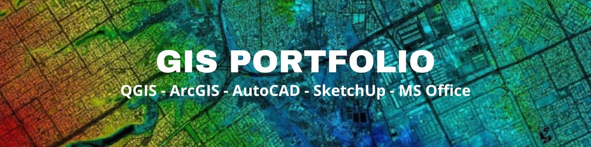

# O mnie
Nazywam się Piotr Ziaja i jestem absolwentem studiów inżynierskich Uniwersytetu im. Adama Mickiewicza w Poznaniu na kierunku Gospodarka Przestrzenna. Zdobyłem podstawową wiedzę z zakresu planowania przestrzennego i rozwoju regionalnego. Posiadam praktyczne umiejętności obsługi narzędzi GIS, CAD, SketchUp oraz MS Office w celu opracowywania czytelnych analiz i formułowania wniosków dla dokumentów strategicznych oraz przygotowania koncepcji zagospodarowania przestrzennego.

# Projekt
Mój ostatni projekt dotyczył mojej pracy inżynierskiej pt.: „Koncepcja zagospodarowania przestrzennego terenów: ROD przy ul. Hetmańskiej oraz terenu pomiędzy ul. Hetmańską i Krathofera w Poznaniu” i koncentrował się na procesie oceny i ustalania zasad dotyczących zagospodarowania przestrzennego na danym obszarze, aby opracować zrównoważoną koncepcję zagospodarowania przestrzennego służącą mieszkańcom miasta Poznań.

Lokalizacja obszaru opracowania:
```geojson
{
  "type": "FeatureCollection",
  "features": [
    {
      "type": "Feature",
      "properties": {},
      "geometry": {
        "coordinates": [
          [
            [
              16.89966723837884,
              52.390284211630586
            ],
            [
              16.89897838047648,
              52.38938769569219
            ],
            [
              16.898696197721733,
              52.388805203826394
            ],
            [
              16.902713152235208,
              52.38743251868249
            ],
            [
              16.903941477169298,
              52.388825464542236
            ],
            [
              16.902605258828828,
              52.389661210959474
            ],
            [
              16.902256680131046,
              52.38977770768835
            ],
            [
              16.89966723837884,
              52.390284211630586
            ]
          ]
        ],
        "type": "Polygon"
      }
    },
    {
      "type": "Feature",
      "properties": {},
      "geometry": {
        "coordinates": [
          [
            [
              16.90305362392192,
              52.38671970084701
            ],
            [
              16.901725852353763,
              52.3872672996724
            ],
            [
              16.89998765061884,
              52.3879017746975
            ],
            [
              16.898797642686333,
              52.388303224179225
            ],
            [
              16.89843135437374,
              52.38837494905002
            ],
            [
              16.8981319120376,
              52.38802261120691
            ],
            [
              16.897907076361093,
              52.38773980686466
            ],
            [
              16.89712926444082,
              52.387184329967994
            ],
            [
              16.896148623530422,
              52.38645909908064
            ],
            [
              16.89625542717104,
              52.38631690231455
            ],
            [
              16.900425777276894,
              52.38504148006882
            ],
            [
              16.901346111013737,
              52.38474221902223
            ],
            [
              16.901512945815313,
              52.38461723075045
            ],
            [
              16.903073471076254,
              52.38408320689942
            ],
            [
              16.90326456938064,
              52.384291086586245
            ],
            [
              16.903614566179897,
              52.38537922980879
            ],
            [
              16.90352404374306,
              52.38545598023512
            ],
            [
              16.90258587891927,
              52.385757433046535
            ],
            [
              16.902617072467507,
              52.385994763721015
            ],
            [
              16.90305362392192,
              52.38671970084701
            ]
          ]
        ],
        "type": "Polygon"
      }
    }
  ]
}
```

<h2>📫 Kontakt</h2>

<a href="https://www.linkedin.com/in/piozia98/"></a>
